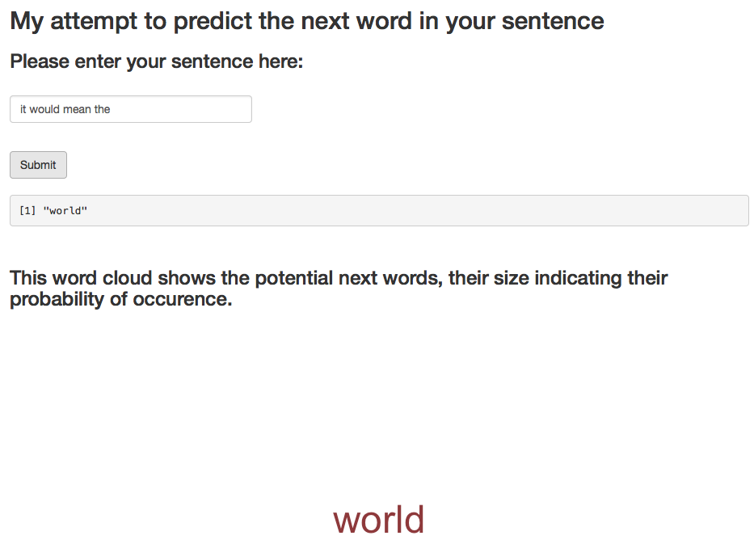

## Introduction to the project

### The aim for this analysis is to explore the three text data sets: US twitter, blog and news extracts. Using the frequencies of the words, bigrams and trigrams that feature in the data sets, I created a algorithm to predict the next word in a sentence.

* Only the English words were used in the analysis and the data sets were taken from:  https://d396qusza40orc.cloudfront.net/dsscapstone/dataset/Coursera-SwiftKey.zip 

--- .class #id 

## How I went about addressing the problem

* First, I cleaned the data sets, removing the punctuation, and converting to lower case.

* Second, I took the frequencies of the unigrams, bigrams and trigrams present in the three data sets.
  * This was not trivial, as the data sets were massive, so I split them up to process them better.
  * Similarly, I removed all words that occurred less than 10 times, to reduce the search space of the algorithm so that it can run in real time on the app.
  
* The algorithm works by checking for the presence of bigrams/words at the start of trigrams or bigrams and predicts according to the words that follow them. The probabilities were determined from the frequency of the words in the corpora. If the previous words did not occur in either trigrams or bigrams, then the unigram probabilities are used to predict the word.

--- .class #id 

## The product

The app itself has a simple, easy to use interface. The sentence is added and then a predicted word is returned once *Submit* is pressed. A wordcloud is also provided, to show the possible words that could be returned by the algorithm.

```{r, out.width = "600px", echo = FALSE}

```

--- .class #id 

## Limitations in the product

### The search space for the algorithm has been greatly reduced, in order to allow it to run in real time. However this reduces accuracy.  


### The use of higher order ngrams may add accuracy to the algorithm. However, these were not used to ensure a fast performance of the app.

